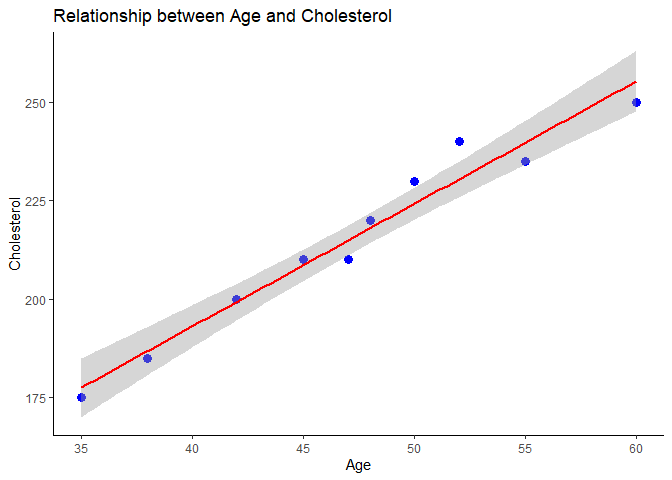
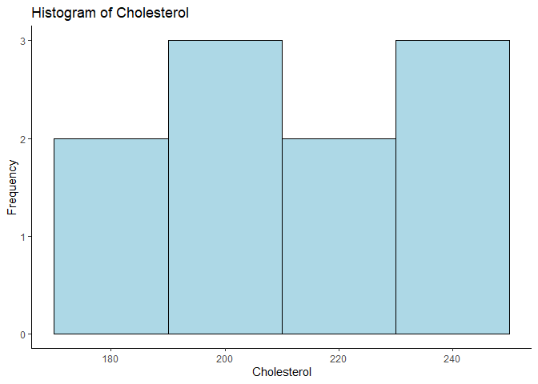

# Correlation Analysis

## Introduction

A *correlation analysis* is a statistical method used to examine the
strength and direction of the relationship between two continuous
variables.

The most commonly used correlation coefficient is **Pearson’s
correlation coefficient**, which measures the linear relationship
between two variables. Pearson’s correlation coefficient, denoted by
“r,” takes on values between -1 and 1, where a value of -1 indicates a
perfect negative correlation, a value of 0 indicates no correlation, and
a value of 1 indicates a perfect positive correlation.

To perform a correlation analysis, we first must collect data on the two
variables of interest. Once we have the data, we can calculate the
correlation coefficient using R.

For example, suppose we want to examine the relationship between a
person’s age and their cholesterol level. We collect data on 100
individuals and obtained the following data:

$$
\large -1 \leq r \leq 1
$$

where:

-   *r* = −1 indicates a perfect negative correlation,
-   *r* = 0 indicates no correlation,
-   *r* = 1 indicates a perfect positive correlation.

## Example Dataset

We will examine the relationship between a person’s age and their
cholesterol level using sample data:

    # Load necessary libraries
    library(ggplot2)

    # Create age and cholesterol vectors
    age <- c(45, 38, 52, 60, 35, 42, 48, 55, 50, 47)
    cholesterol <- c(210, 185, 240, 250, 175, 200, 220, 235, 230, 210)

    # Combine the vectors into a dataframe
    mydata <- data.frame(age = age, cholesterol = cholesterol)

### Data Representation

<table>
<caption>Age and Cholesterol</caption>
<thead>
<tr class="header">
<th style="text-align: right;">age</th>
<th style="text-align: right;">cholesterol</th>
</tr>
</thead>
<tbody>
<tr class="odd">
<td style="text-align: right;">45</td>
<td style="text-align: right;">210</td>
</tr>
<tr class="even">
<td style="text-align: right;">38</td>
<td style="text-align: right;">185</td>
</tr>
<tr class="odd">
<td style="text-align: right;">52</td>
<td style="text-align: right;">240</td>
</tr>
<tr class="even">
<td style="text-align: right;">60</td>
<td style="text-align: right;">250</td>
</tr>
<tr class="odd">
<td style="text-align: right;">35</td>
<td style="text-align: right;">175</td>
</tr>
<tr class="even">
<td style="text-align: right;">42</td>
<td style="text-align: right;">200</td>
</tr>
<tr class="odd">
<td style="text-align: right;">48</td>
<td style="text-align: right;">220</td>
</tr>
<tr class="even">
<td style="text-align: right;">55</td>
<td style="text-align: right;">235</td>
</tr>
<tr class="odd">
<td style="text-align: right;">50</td>
<td style="text-align: right;">230</td>
</tr>
<tr class="even">
<td style="text-align: right;">47</td>
<td style="text-align: right;">210</td>
</tr>
</tbody>
</table>

Age and Cholesterol

## Scatter Plot

    ggplot(mydata, aes(x = age, y = cholesterol)) + 
      geom_point(color = "blue", size = 3) + 
      geom_smooth(method = "lm", col = "red") +
      labs(title = "Relationship between Age and Cholesterol", x = "Age", y = "Cholesterol") +
      theme_minimal()

    ## `geom_smooth()` using formula = 'y ~ x'

## Assumptions of Pearson Correlation

### 1. Normality Check

#### Histogram of Age

    ggplot(mydata, aes(x = age)) +
      geom_histogram(binwidth = 5, fill = "lightblue", color = "black") +
      labs(title = "Histogram of Age", x = "Age", y = "Frequency") +
      theme_minimal()

#### Histogram of Cholesterol

    ggplot(mydata, aes(x = cholesterol)) +
      geom_histogram(binwidth = 20, fill = "lightblue", color = "black") +
      labs(title = "Histogram of Cholesterol", x = "Cholesterol", y = "Frequency") +
      theme_minimal()

#### Shapiro-Wilk Test for Normality

    shapiro.test(mydata$age) 

    ## 
    ##  Shapiro-Wilk normality test
    ## 
    ## data:  mydata$age
    ## W = 0.99077, p-value = 0.9977

    shapiro.test(mydata$cholesterol)

    ## 
    ##  Shapiro-Wilk normality test
    ## 
    ## data:  mydata$cholesterol
    ## W = 0.96909, p-value = 0.8823

### 2. Linearity Check

    ggplot(mydata, aes(x = age, y = cholesterol)) + 
      geom_point(color = "blue", size = 3) + 
      geom_smooth(method = "lm", col = "red") +
      labs(title = "Linearity Check", x = "Age", y = "Cholesterol") +
      theme_minimal()

    ## `geom_smooth()` using formula = 'y ~ x'

## Pearson Correlation Calculation

The Pearson correlation coefficient is calculated using:
$$
r = \frac{\sum (X\_i - \bar{X}) (Y\_i - \bar{Y})}{\sqrt{\sum (X\_i - \bar{X})^2 \sum (Y\_i - \bar{Y})^2}}
$$

    cor(mydata$age, mydata$cholesterol)

    ## [1] 0.9792846

### Statistical Significance Test

    cor.test(mydata$age, mydata$cholesterol)

    ## 
    ##  Pearson's product-moment correlation
    ## 
    ## data:  mydata$age and mydata$cholesterol
    ## t = 13.679, df = 8, p-value = 7.858e-07
    ## alternative hypothesis: true correlation is not equal to 0
    ## 95 percent confidence interval:
    ##  0.9119540 0.9952539
    ## sample estimates:
    ##       cor 
    ## 0.9792846

## Spearman Rank Correlation

When normality assumptions are violated, we use **Spearman’s rank
correlation**:

$$
\rho = 1 - \frac{6 \sum d\_i^2}{n(n^2 - 1)}
$$
where *d**i* is the difference between ranks.

### Example Data

    # Creating two vectors
    Hr_St <- c(2, 3, 5, 6, 7, 8, 9, 10, 12, 14)
    Test_score <- c(60, 70, 80, 85, 90, 95, 98, 100, 99, 95)

    # Combine the vectors into a dataframe
    mydata_spearman <- data.frame(Hr_St = Hr_St, Test_score = Test_score)

### Spearman Correlation Calculation

    cor.test(mydata_spearman$Hr_St, mydata_spearman$Test_score, method = "spearman")

    ## Warning in cor.test.default(mydata_spearman$Hr_St, mydata_spearman$Test_score,
    ## : Cannot compute exact p-value with ties

    ## 
    ##  Spearman's rank correlation rho
    ## 
    ## data:  mydata_spearman$Hr_St and mydata_spearman$Test_score
    ## S = 17.553, p-value = 0.0004919
    ## alternative hypothesis: true rho is not equal to 0
    ## sample estimates:
    ##       rho 
    ## 0.8936211

## Conclusion

-   Pearson’s correlation coefficient is used for linear relationships
    assuming normality.
-   Spearman’s correlation is robust to non-normal distributions and
    outliers.
-   The results indicate a **strong positive correlation** in both
    cases, implying a significant association between the variables.

#### References

1.  Pearson, K. (1895). “Notes on Regression and Inheritance in the Case
    of Two Parents.” *Proceedings of the Royal Society of London*,
    58(1), 240–242.
2.  Spearman, C. (1904). “The Proof and Measurement of Association
    between Two Things.” *The American Journal of Psychology*, 15(1),
    72–101.
3.  Shapiro, S. S., & Wilk, M. B. (1965). “An Analysis of Variance Test
    for Normality (Complete Samples).” *Biometrika*, 52(3-4), 591–611.
4.  Cohen, J. (1988). *Statistical Power Analysis for the Behavioral
    Sciences*. Routledge.

[⬅ Back to Home](../index.md)
